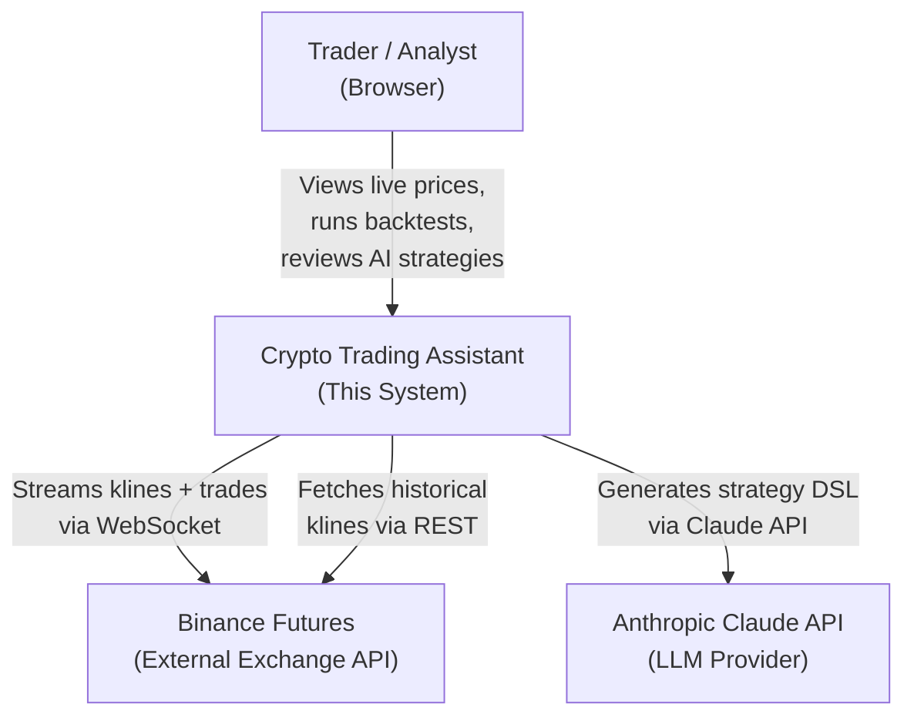
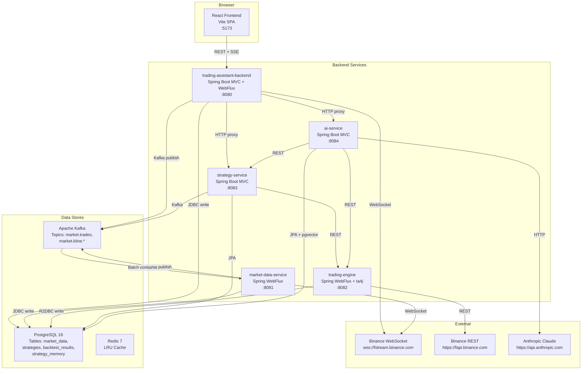
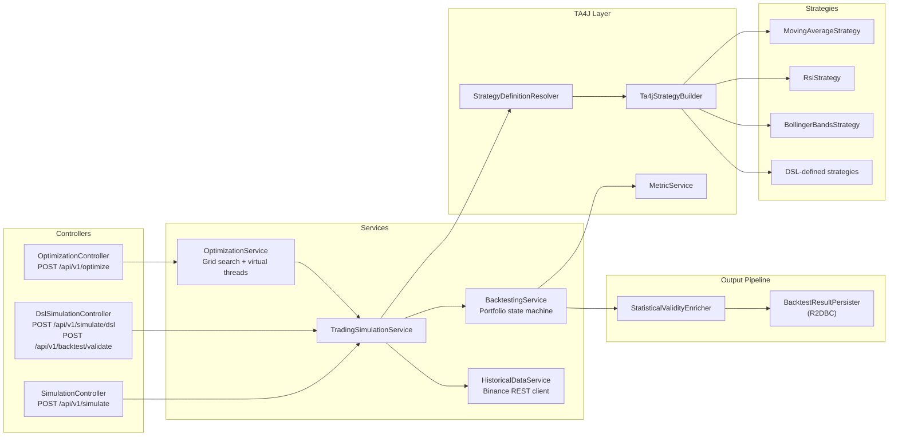
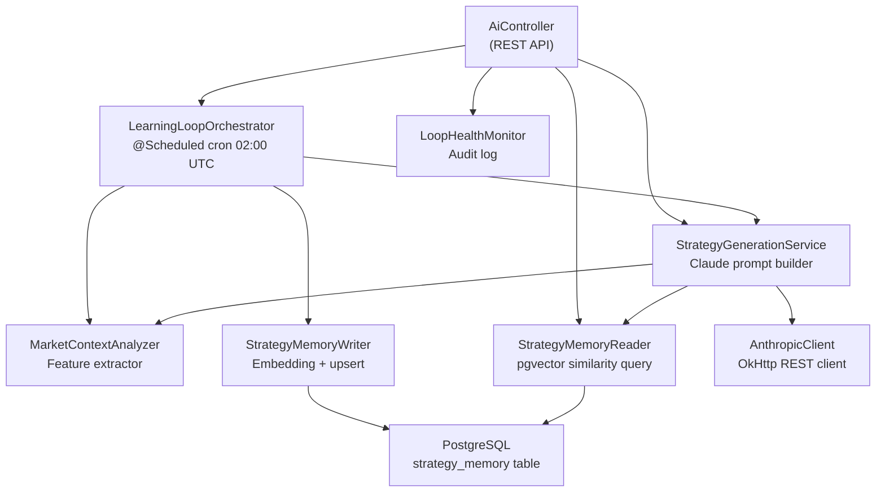
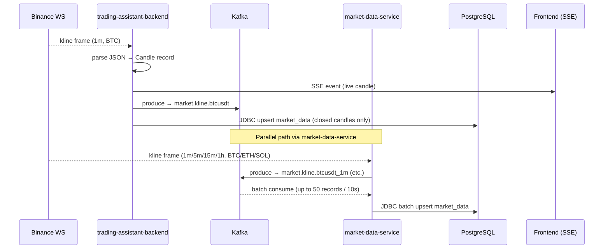
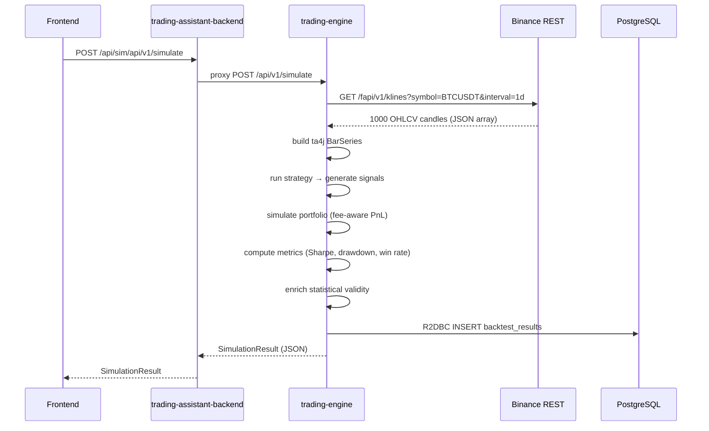
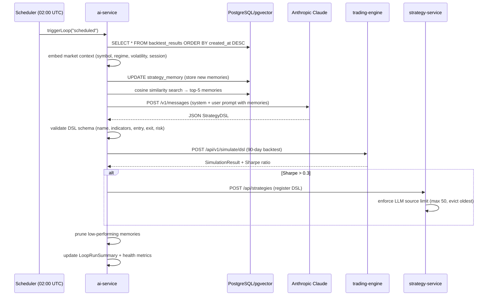
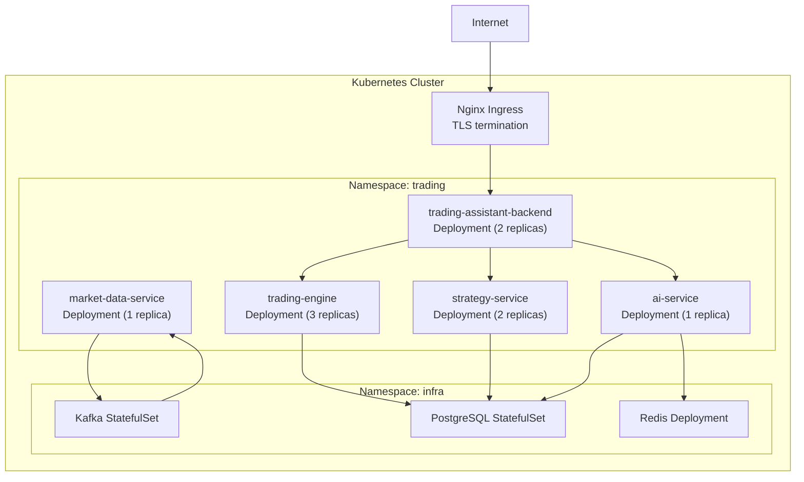

# Architecture

This document describes the system architecture of the Crypto Trading Assistant at multiple levels of detail, following the C4 model convention.

---

## C4 Level 1 — System Context



The system has one user (the trader/analyst), two external dependencies (Binance and Anthropic), and no real-money order execution — it is a read-only/analytics platform.

---

## C4 Level 2 — Container Diagram



---

## C4 Level 3 — Key Component Detail

### trading-engine internals



### ai-service internals



---

## End-to-End Data Flows

### Flow 1: Live Candle Streaming to Browser



### Flow 2: Backtest Simulation Request



### Flow 3: AI Learning Loop (Nightly)



---

## Database Schema

```sql
-- OHLCV candle storage — idempotent upsert via 4-column unique key
market_data          (exchange, symbol, interval, open_time UNIQUE)

-- Strategy definitions stored as JSONB — supports GIN index queries
strategies           (id UUID, name, source CHECK IN ('BUILTIN','USER','LLM','EVOLVED'), dsl JSONB, is_active)

-- Simulation results — linked to strategies
backtest_results     (id UUID, strategy_id FK, symbol, interval, from_time, to_time,
                      total_trades, win_rate, total_pnl, max_drawdown, sharpe_ratio,
                      is_statistically_valid, validation_note)

-- Vector memory store for RAG — 1536-dimension cosine similarity
strategy_memory      (id UUID, strategy_id FK, symbol, interval, embedding vector(1536),
                      document TEXT, sharpe_ratio, verdict, created_at)
```

**Index strategy:**
- `market_data`: composite B-tree `(exchange, symbol, interval, open_time DESC)` for time-range queries
- `strategies`: GIN index on `dsl` JSONB column for field-level filtering; partial B-tree on `(is_active = true)` for listing
- `strategy_memory`: IVFFlat ANN index on `embedding` (created after initial data load; falls back to sequential scan until then)

---

## Security Architecture

| Concern | Current Approach | Production Recommendation |
|---|---|---|
| **Authentication** | None (local dev) | JWT tokens issued by an auth service; verify in BFF gateway |
| **API Key Management** | Environment variables (`.env` file) | Kubernetes Secrets or HashiCorp Vault |
| **Binance Keys** | Not required for public data streams | Store in Vault; inject as env vars at runtime |
| **Anthropic API Key** | `ANTHROPIC_API_KEY` env var | Vault secret; rotate regularly |
| **Database Credentials** | `POSTGRES_USER/PASSWORD` env vars | Vault dynamic secrets; short-lived credentials |
| **CORS** | Allowed origin `http://localhost:5173` | Restrict to production domain in `WebConfig` |
| **Network** | All services on localhost | Service mesh (Istio mTLS) between pods in Kubernetes |

---

## Observability

| Signal | Implementation | Notes |
|---|---|---|
| **Structured Logs** | SLF4J + Logback | Each log line includes service name, class, correlation context |
| **Log Levels** | DEBUG for business logic, INFO for lifecycle events, WARN for reconnects/retries, ERROR for failures | Configured per-package in `application.properties` |
| **Key Log Events** | Simulation start/complete, Kafka publish/consume batch size, WebSocket connect/disconnect, learning loop step completion | Enables log-based alerting in production |
| **Metrics (Planned)** | Micrometer + Prometheus | `/actuator/prometheus` on all services |
| **Tracing (Planned)** | OpenTelemetry + Jaeger | Trace IDs across service calls |
| **Health Checks** | Spring Boot Actuator `/actuator/health` | Ready for Kubernetes liveness/readiness probes |

---

## Deployment Architecture (Target)



Each service is independently deployable. The `trading-engine` is horizontally scaled to absorb parallel optimisation requests. `market-data-service` runs as a singleton to avoid duplicate Kafka messages. The `ai-service` runs as a singleton to avoid concurrent learning loop executions.
