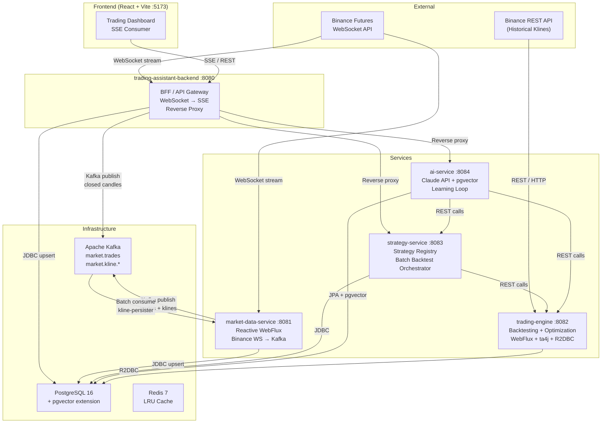

# Crypto Trading Assistant

> Real-time algorithmic trading assistant built on cloud-native microservices — streaming live market data, running multi-strategy backtests, and generating AI-powered strategies through a self-improving learning loop.


---

## What This Project Does

This platform ingests live crypto futures data from Binance via persistent WebSocket connections, normalises and publishes price events to Kafka, persists OHLCV candles to PostgreSQL, and exposes them to a React dashboard via Server-Sent Events. A dedicated backtesting engine runs configurable strategies (MA Crossover, RSI, Bollinger Bands, or custom DSL-defined rules) against historical data and produces equity curves, trade logs, and risk-adjusted metrics. An AI service wraps the Anthropic Claude API with a vector-similarity memory layer (pgvector) to iteratively generate, backtest, and promote higher-Sharpe strategies on a nightly schedule.

The project is designed from the ground up for **fintech backend engineering** concerns: low-latency reactive pipelines, idempotent upserts, structured JSON logging, fault-tolerant reconnect logic, and a clean separation of concerns across independently deployable microservices.

---

## Architecture Overview



**Key flows:**
- **Live data pipeline:** Binance WebSocket → `trading-assistant-backend` normalises candles → publishes to `market.kline.*` Kafka topics → `market-data-service` batch-consumes and upserts to `market_data` table. Simultaneously, SSE events are pushed to the React frontend.
- **Backtesting flow:** Frontend sends a simulation request → `trading-assistant-backend` proxies to `trading-engine` → engine fetches historical klines from Binance REST, runs the strategy via ta4j, computes equity curve + metrics → persists result via R2DBC → returns `SimulationResult`.
- **AI learning loop:** Nightly at 02:00 UTC, `ai-service` fetches recent backtest results, embeds market context into pgvector, retrieves the top-5 similar past strategies, prompts Claude to generate a new strategy, backtests it via `trading-engine`, and promotes high-Sharpe results to `strategy-service`.

---

## Key Features

- **Reactive market data pipeline** — WebFlux + Reactor Netty WebSocket client with infinite exponential-backoff reconnect; ingests BTC, ETH, SOL klines across 4 timeframes (1m, 5m, 15m, 1h) simultaneously
- **Event-driven candle persistence** — Kafka batch consumer (`max-poll-records=50`) upserts up to 50 closed candles per flush with a 4-column composite unique constraint for idempotency; never double-counts a candle on replay
- **Multi-strategy backtesting engine** — MA Crossover, RSI mean-reversion, and Bollinger Bands strategies backed by ta4j; supports LONG_ONLY, SHORT_ONLY, and BOTH trade directions with configurable fee rates and position-sizing models (full balance, percent, fixed amount)
- **Parameter optimisation** — Grid-search over arbitrary parameter combinations with a configurable virtual-thread pool; top-N results ranked by Sharpe, Sortino, max drawdown, or total return
- **AI strategy generation** — Retrieval-augmented generation (RAG) via pgvector cosine similarity: historical backtest memories are embedded and the top-k most relevant are injected into a Claude prompt; strategies are validated and auto-promoted on a nightly cron schedule
- **Strategy DSL** — Declarative JSON strategy format with named indicators, boolean entry/exit rule expressions, and risk config (stop-loss %, take-profit %, trailing stop); parsed and executed by a custom ta4j rule compiler
- **Statistical validity enrichment** — Every backtest result is annotated with a validity flag and note (minimum trade count, out-of-sample validation window enforcement)
- **Fault-tolerant gateway** — `trading-assistant-backend` acts as a reverse proxy with 30-second timeouts; returns structured `503` responses when downstream services are unavailable, preventing frontend hangs

---

## Tech Stack

| Layer | Technology | Purpose |
|---|---|---|
| **Backend Runtime** | Java 25, Spring Boot 4.0.5 | All five microservices; virtual threads via `spring.threads.virtual.enabled=true` |
| **Reactive Web** | Spring WebFlux, Project Reactor | Non-blocking HTTP and WebSocket I/O in `market-data-service` and `trading-engine` |
| **Messaging** | Apache Kafka (Confluent 7.5) | Decoupled candle event streaming between services |
| **Database** | PostgreSQL 16 + pgvector | OHLCV storage, strategy registry, backtest results, vector memory store |
| **Reactive DB** | R2DBC (r2dbc-postgresql) | Non-blocking backtest result persistence in `trading-engine` |
| **AI / LLM** | Anthropic Claude API (claude-sonnet-4) | Strategy generation with structured JSON output |
| **Vector Search** | pgvector (IVFFlat index) | Cosine-similarity retrieval of past strategy memories for RAG |
| **Technical Analysis** | ta4j 0.22.3 | Indicator computation, rule evaluation, metric calculation |
| **Frontend** | React 18, Vite | Real-time trading dashboard; SSE-driven candle chart |
| **Observability** | SLF4J + Logback (structured logs) | Per-service JSON-formatted logs; DEBUG level for business logic |
| **Infrastructure** | Docker Compose, Redis 7 | Local dev environment; Redis for LRU caching |
| **HTTP Client** | Spring `RestClient`, OkHttp | Synchronous service-to-service calls; `WebClient` for reactive proxy |
| **Validation** | Jakarta Bean Validation | Request validation on all REST endpoints |

---

## Project Structure

```
crypto-trading-app/
├── trading-assistant-backend/   # BFF gateway: WebSocket ingestion, SSE, reverse proxy    :8080
├── market-data-service/         # Reactive market data: Binance WS → Kafka → PostgreSQL   :8081
├── trading-engine/              # Backtesting + optimisation engine (WebFlux + ta4j)       :8082
├── strategy-service/            # Strategy registry, validation, batch backtest runner     :8083
├── ai-service/                  # Claude integration, pgvector RAG, learning loop          :8084
├── frontend/                    # React + Vite trading dashboard                           :5173
├── local-application-setup/     # Docker Compose (Kafka, PostgreSQL, Redis) + SQL schema
│   ├── docker-compose.yml
│   └── sql/init.sql
├── microservices-architecture.drawio
├── ARCHITECTURE.md
├── CONTRIBUTING.md
└── README.md
```

---

## Microservices Overview

| Service | Responsibility | Port | Key Dependencies |
|---|---|---|---|
| `trading-assistant-backend` | BFF gateway: Binance WebSocket → SSE stream, Kafka publisher, reverse proxy to downstream services | 8080 | Kafka, PostgreSQL (JDBC), WebClient |
| `market-data-service` | Reactive ingestion of Binance futures trades and klines; Kafka producer + batch consumer for persistence | 8081 | Kafka, PostgreSQL (JPA/JDBC), WebFlux |
| `trading-engine` | Historical data fetching, strategy backtesting, parameter optimisation, statistical validity enrichment | 8082 | Binance REST, PostgreSQL (R2DBC), ta4j |
| `strategy-service` | Strategy CRUD with source-based capacity limits, batch backtest orchestration via virtual threads | 8083 | PostgreSQL (JPA), Kafka, trading-engine REST |
| `ai-service` | Anthropic Claude strategy generation, pgvector similarity memory, nightly self-improvement loop | 8084 | PostgreSQL + pgvector (JPA), Anthropic API, trading-engine REST |
| `frontend` | React dashboard: live candle chart (SSE), strategy builder, backtest results viewer | 5173 | trading-assistant-backend REST + SSE |

---

## Design Decisions

### 1. Why Kafka over direct REST for candle events?
The `market.kline.*` topic decouples producers (WebSocket connectors) from consumers (persistence, analytics). This allows the `KlinePersistenceConsumer` to batch-consume up to 50 records per poll, dramatically reducing PostgreSQL round-trips. It also provides durability: if the database is temporarily unavailable, events are retained in Kafka and replayed without data loss.

### 2. Why WebFlux over traditional Servlet model for market data?
Binance pushes thousands of price ticks per minute across multiple symbols and timeframes. WebFlux's non-blocking I/O means a single thread can manage dozens of open WebSocket connections without blocking, keeping memory and CPU usage flat under load. The `trading-engine` uses the same model for streaming large optimisation result sets without buffering them in memory.

### 3. Why R2DBC in the trading engine alongside JPA elsewhere?
The trading engine's backtest persistence is on the critical path of every simulation response. R2DBC allows the persist step to be chained into the reactive pipeline (`flatMap`) without ever blocking a thread, which is important when the optimization service runs 6+ concurrent simulations on virtual threads.

### 4. Why pgvector for strategy memory?
Strategy performance is highly context-dependent (bull vs bear market, high vs low volatility). Storing backtest results as feature vectors (symbol regime, volatility, session) enables the AI service to retrieve semantically similar past strategies before generating new ones — giving Claude grounded, relevant context rather than generating from scratch.

### 5. Why a Strategy DSL (JSON) instead of code?
A declarative DSL means strategies can be stored in PostgreSQL as JSONB, transmitted over REST, validated without execution, and interpreted by both the backtesting engine and the AI service. The DSL supports `BUILTIN`, `USER`, `LLM`, and `EVOLVED` source types with enforced per-source capacity limits, enabling safe co-evolution of human and AI strategies.

### 6. Why a reverse proxy in the BFF rather than direct service calls from the frontend?
The frontend only needs to know one origin (`http://localhost:8080`), eliminating CORS complexity across five services. The proxy also provides a single point for adding authentication headers, rate limiting, and circuit-breaking in the future — a production-grade pattern for BFF architecture.

---

## Quickstart

### Prerequisites

| Requirement | Version |
|---|---|
| Java (JDK) | 25+ |
| Maven | 3.9+ |
| Docker + Docker Compose | 24+ |
| Node.js | 20+ (for frontend) |
| Binance Account | Futures API access (read-only keys sufficient) |
| Anthropic API Key | For AI strategy generation |

### 1. Clone the repository

```bash
git clone https://github.com/<your-username>/crypto-trading-app.git
cd crypto-trading-app
```

### 2. Configure environment variables

```bash
cp .env.example .env
# Edit .env and fill in:
#   ANTHROPIC_API_KEY — your Anthropic API key
#   BINANCE_API_KEY / BINANCE_API_SECRET — optional for public data streams
```

### 3. Start infrastructure (Kafka + PostgreSQL + Redis)

```bash
cd local-application-setup
docker compose up -d
```

This starts:
- **Kafka** on `localhost:9092` with Zookeeper
- **Kafka UI** on `http://localhost:8087`
- **PostgreSQL 16** (with pgvector) on `localhost:5432`, database `trading`
- **pgAdmin** on `http://localhost:5050` (admin@admin.com / admin)
- **Redis** on `localhost:6379`

The database schema (tables, indexes, pgvector extension) is applied automatically from `sql/init.sql`.

Verify everything is up:
```bash
docker compose ps
# All 5 services should show "Up"
```

### 4. Build and start the microservices

Open **5 terminals** (or use your IDE), one per service:

```bash
# Terminal 1 — trading-engine (start first: other services depend on it)
cd trading-engine && ./mvnw spring-boot:run

# Terminal 2 — strategy-service
cd strategy-service && ./mvnw spring-boot:run

# Terminal 3 — market-data-service
cd market-data-service && ./mvnw spring-boot:run

# Terminal 4 — ai-service
ANTHROPIC_API_KEY=<your-key> ./mvnw spring-boot:run -pl ai-service

# Terminal 5 — trading-assistant-backend (gateway — start last)
cd trading-assistant-backend && ./mvnw spring-boot:run
```

### 5. Start the frontend

```bash
cd frontend
npm install
npm run dev
# Open http://localhost:5173
```

### 6. Verify with a sample API call

```bash
# Run a BTC/USDT backtest using the RSI strategy (last 30 days, daily bars)
curl -s -X POST http://localhost:8082/api/v1/simulate \
  -H "Content-Type: application/json" \
  -d '{
    "symbol": "BTCUSDT",
    "interval": "1d",
    "strategy": "RSI",
    "params": { "period": 14, "overbought": 70, "oversold": 30 },
    "range": {
      "startTime": 1706745600000,
      "endTime":   1714521600000
    },
    "execution": { "type": "FULL_BALANCE", "tradeDirection": "LONG_ONLY", "params": {} },
    "assumptions": {}
  }' | jq '.totalReturn, .tradesCount, .finalBalance'

# List available strategies
curl -s http://localhost:8082/api/v1/strategies | jq '.[].name'

# Trigger an AI strategy generation
curl -s -X POST http://localhost:8084/api/ai/generate \
  -H "Content-Type: application/json" \
  -d '{"symbol":"BTCUSDT","interval":"1h","objective":"Maximise Sharpe ratio with low drawdown"}' \
  | jq '.dsl, .confidence'
```

---

## Roadmap

### Completed
- [x] Reactive Binance WebSocket ingestion with exponential-backoff reconnect
- [x] Kafka-backed candle pipeline with idempotent PostgreSQL upserts
- [x] Multi-strategy backtesting engine (MA, RSI, Bollinger Bands, DSL-driven)
- [x] Long/short/both trade direction support with realistic fee simulation
- [x] Parameter grid optimisation with virtual-thread parallelism
- [x] Statistical validity enrichment and held-out validation endpoint
- [x] Strategy DSL with declarative indicator and rule composition
- [x] Strategy registry with source-based capacity limits (BUILTIN/USER/LLM/EVOLVED)
- [x] Batch backtest orchestrator with semaphore-bounded concurrency
- [x] AI strategy generation via Anthropic Claude with RAG over pgvector memory
- [x] Nightly self-improvement learning loop (generate → backtest → promote → prune)
- [x] React frontend with live SSE candle streaming and backtest result viewer
- [x] Full Docker Compose local dev environment

### Planned
- [ ] JWT-based authentication and per-user strategy namespacing
- [ ] Distributed tracing with OpenTelemetry + Jaeger
- [ ] Prometheus metrics endpoint (`/actuator/prometheus`) on all services
- [ ] Kubernetes Helm charts for cloud deployment
- [ ] Paper trading mode: forward-test live signals without real orders
- [ ] Strategy performance leaderboard with public shareable links
- [ ] Multi-exchange support (OKX, Bybit)
- [ ] Webhook alerts (Telegram / Slack) on strategy signal events
- [ ] CI/CD pipeline (GitHub Actions) with integration test suite

---

## License

[MIT License](LICENSE) — free to use, fork, and build on.

---

## Contact

Built by a backend engineer passionate about event-driven systems and quantitative finance.

- **LinkedIn:** [linkedin.com/in/your-profile](https://linkedin.com/in/your-profile)
- **Email:** your.email@example.com
- **GitHub:** [@your-username](https://github.com/your-username)
