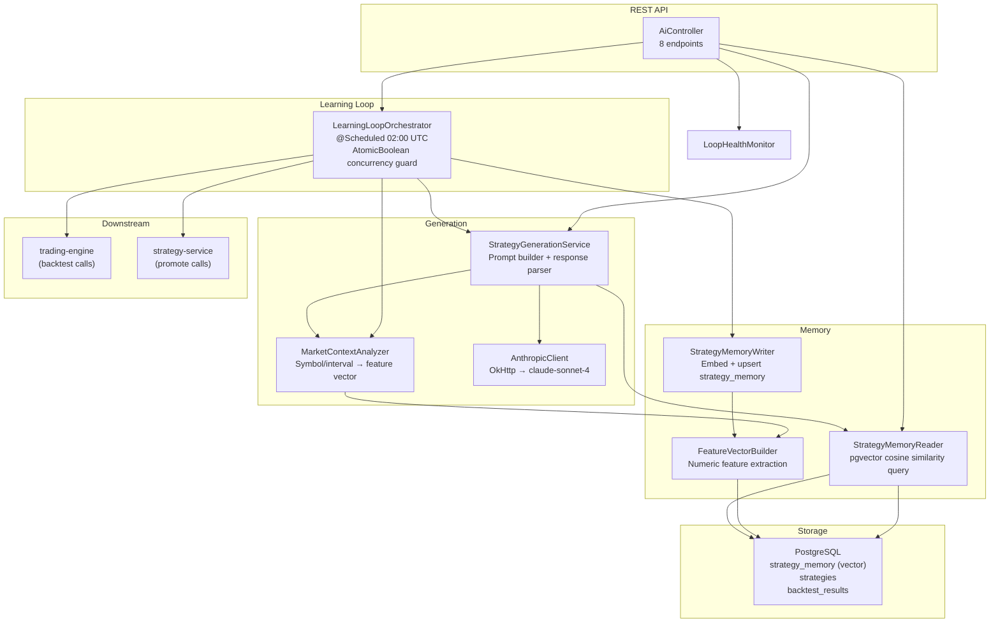

# ai-service

> AI intelligence layer — generates novel trading strategies using Anthropic Claude with retrieval-augmented generation (RAG) over a pgvector memory store, and runs a self-improving nightly learning loop that backtests, validates, and promotes the best AI-generated strategies.

**Port:** `8084`  
**Spring Boot:** 4.0.5 | **Java:** 25 | **Model:** Spring MVC with virtual threads

---

## Responsibilities

- Generates trading strategy DSLs by prompting Claude with retrieved context from past backtest results
- Maintains a semantic memory store in PostgreSQL via pgvector: embeds market context and strategy performance as feature vectors, enabling cosine-similarity retrieval of the most relevant past strategies
- Runs a nightly learning loop (02:00 UTC) that iterates through 8 steps: fetch results → store memories → analyze → generate → validate → backtest → promote → prune
- Exposes REST endpoints for manual loop triggering, memory inspection, loop health metrics, and audit history
- Tracks loop health metrics: memory quality, success rate, pause state, and consecutive poor run detection

---

## Internal Architecture



---

## API Reference

| Method | Path | Description | Request Body | Response |
|---|---|---|---|---|
| `POST` | `/api/ai/generate` | Generate a new strategy using Claude | `GenerationRequest` JSON | `GenerationResult` |
| `POST` | `/api/ai/memory/store` | Store a backtest result as a memory | `{ strategyId, backtestResultId }` | `StorageResult` |
| `GET` | `/api/ai/memory/stats` | Memory store statistics | — | `{ totalRecords, avgSharpe, verdictBreakdown, oldestRecord }` |
| `GET` | `/api/ai/memory/relevant` | Top-K most relevant memories for context | `?symbol=BTCUSDT&interval=1h&topK=5` | `List<MemoryRecord>` |
| `POST` | `/api/ai/loop/trigger` | Manually trigger the learning loop | — | `{ status, loopRunId }` (202) |
| `GET` | `/api/ai/loop/status` | Current loop state and last run summary | — | `{ lastRunAt, isRunning, lastSummary, nextRun }` |
| `GET` | `/api/ai/loop/health` | Loop health metrics | — | `LoopHealth` |
| `GET` | `/api/ai/loop/history` | Last 7 audit log summaries | — | `List<Map>` |

### GenerationRequest schema

```json
{
  "symbol":    "BTCUSDT",
  "interval":  "1h",
  "objective": "Maximise Sharpe ratio with max drawdown below 15%"
}
```

### GenerationResult schema

```json
{
  "dsl":                  "{...strategy JSON...}",
  "reasoning":            "Generated from 5 memories",
  "confidence":           "HIGH",
  "retrievedMemoryCount": 5,
  "error":                null
}
```

### LoopHealth schema

```json
{
  "memoryQuality":      "GOOD",
  "successRate":        0.85,
  "memoryCount":        142,
  "isPaused":           false,
  "consecutivePoorRuns": 0
}
```

---

## Learning Loop — 8-Step Pipeline

| Step | Name | Description |
|---|---|---|
| 1 | FETCH | Load all backtest results from `backtest_results` table, newest first |
| 2 | STORE | For each result, embed market context + performance into `strategy_memory` via pgvector |
| 3 | ANALYZE | Compute avg Sharpe, identify best/worst strategies, capture current market context |
| 4 | GENERATE | Prompt Claude to generate a new strategy DSL using top-5 retrieved memories as context |
| 5 | VALIDATE | Parse and schema-validate the generated DSL JSON |
| 6 | BACKTEST | Submit validated DSL to trading-engine; accept strategies with Sharpe > 0.3 |
| 7 | PROMOTE | Register accepted strategies in strategy-service as source `LLM` |
| 8 | PRUNE | Remove low-quality memories to keep the vector store lean |

The loop is guarded by an `AtomicBoolean` — concurrent triggers are skipped. If the loop produces poor results for multiple consecutive runs, it self-pauses until the next scheduled window.

---

## Claude Prompt Design

The system prompt instructs Claude to output **only valid JSON** (no markdown, no explanation):

```
You are a quantitative trading strategy generator for crypto futures markets.
Your ONLY output is a valid JSON object.

Optimize for: Sharpe ratio > 1.5, max drawdown < 15%, minimum 50 trades over 6 months.
Available indicators: RSI, EMA, SMA, MACD, ATR, BB_UPPER, BB_LOWER, BB_MIDDLE, STOCH_K, VOLUME
```

The user prompt injects:
1. **PAST RESULTS** — up to 5 most relevant memories (retrieved via pgvector cosine similarity)
2. **CURRENT MARKET** — symbol, interval, trend regime, volatility level, trading session
3. **OBJECTIVE** — caller-specified optimisation goal

This RAG pattern grounds Claude's output in empirically validated past performance rather than generating strategies from scratch.

---

## pgvector Memory Store

The `strategy_memory` table stores each strategy's performance as a feature vector:

| Feature | Description |
|---|---|
| `symbol` | Encoded trading pair (BTC=0, ETH=1, SOL=2, ...) |
| `interval` | Encoded timeframe (1m=0, 5m=1, 15m=2, 1h=3, 4h=4, 1d=5) |
| `trend` | Market trend at backtest time (-1=bear, 0=sideways, 1=bull) |
| `volatility` | Volatility level (0=low, 1=medium, 2=high) |
| `session` | Trading session (0=Asia, 1=London, 2=NY) |

The `document` column stores a human-readable text summary of the strategy and its results for injection into the Claude prompt.

Similarity search uses cosine distance: strategies that performed well in similar market regimes are retrieved first.

---

## Configuration

| Property | Env Var | Default | Description |
|---|---|---|---|
| `server.port` | — | `8084` | HTTP server port |
| `anthropic.api.key` | `ANTHROPIC_API_KEY` | *(required)* | Anthropic API key |
| `anthropic.api.base-url` | — | `https://api.anthropic.com/v1` | Anthropic API base URL |
| `spring.datasource.url` | `POSTGRES_URL` | `jdbc:postgresql://localhost:5432/trading` | PostgreSQL JDBC URL |
| `spring.datasource.username` | `POSTGRES_USER` | `trading` | PostgreSQL username |
| `spring.datasource.password` | `POSTGRES_PASSWORD` | `trading` | PostgreSQL password |
| `services.strategy-service-url` | `STRATEGY_SERVICE_URL` | `http://localhost:8082` | Strategy service URL |
| `services.trading-engine-url` | `TRADING_ENGINE_URL` | `http://localhost:8081` | Trading engine URL |
| `cors.allowed-origins` | — | `http://localhost:5173,http://localhost:8080` | Allowed CORS origins |
| `spring.threads.virtual.enabled` | — | `true` | Enable virtual threads |

---

## Running Locally

```bash
# Requires: infrastructure + trading-engine + strategy-service running
cd local-application-setup && docker compose up -d && cd ..

cd ai-service
ANTHROPIC_API_KEY=sk-ant-your-key ./mvnw spring-boot:run
```

### Verify

```bash
# Check memory store stats (empty on first run)
curl -s http://localhost:8084/api/ai/memory/stats | jq .

# Generate a strategy
curl -s -X POST http://localhost:8084/api/ai/generate \
  -H "Content-Type: application/json" \
  -d '{"symbol":"BTCUSDT","interval":"1h","objective":"Maximise Sharpe"}' \
  | jq '{confidence, retrievedMemoryCount}'

# Trigger the learning loop manually
curl -s -X POST http://localhost:8084/api/ai/loop/trigger | jq .

# Check loop health
curl -s http://localhost:8084/api/ai/loop/health | jq .
```

---

## Testing

```bash
cd ai-service
./mvnw test
```

The test suite covers `StrategyGenerationService` JSON parsing and validation logic, and `MarketContextAnalyzer` feature extraction.

---

## Key Design Patterns

### Retrieval-Augmented Generation (RAG)
Rather than prompting Claude with a generic instruction, the service retrieves the top-5 most contextually similar past backtest results and injects them as grounding context. This dramatically improves the quality of generated strategies — Claude "learns" from what has worked in similar market conditions.

### Atomic concurrency guard
`LearningLoopOrchestrator` uses `AtomicBoolean.compareAndSet(false, true)` to ensure only one loop execution runs at a time, even if multiple triggers arrive concurrently (e.g., manual API trigger racing with the scheduled cron). This is a lock-free, thread-safe approach appropriate for a single-instance service.

### Self-pause on poor performance
The orchestrator tracks `consecutivePoorRuns`. After a configurable threshold of runs that generate no promotable strategies, the loop pauses itself until the next scheduled window. This prevents wasting Claude API credits when the market context is not conducive to strategy generation.

### Structured JSON output enforcement
The system prompt explicitly instructs Claude to output only valid JSON with no preamble or markdown. The `extractJsonFromResponse()` method strips markdown code fences defensively before parsing. The `validateStrategyJson()` method checks for all required fields before the result is used — failing gracefully rather than propagating a malformed strategy.

---

## Known Limitations / Future Improvements

- **Single-symbol generation** — the learning loop currently generates strategies only for BTCUSDT/1h; extending to all tracked symbols and intervals would diversify the strategy portfolio
- **No embedding model** — feature vectors are currently hand-crafted numeric encodings; using a real embedding model (e.g., `text-embedding-3-small`) would enable richer similarity matching
- **Memory store not pruned** — Step 8 (PRUNE) is implemented as a stub; adding a real pruning policy (e.g., evict memories older than 90 days with Sharpe < 0.5) would prevent the vector store from growing unboundedly
- **Synchronous Claude calls** — `AnthropicClient` uses OkHttp synchronously; migrating to WebClient would allow reactive backpressure in the generation pipeline
- **No model version pinning** — the Claude model is hardcoded in the system prompt; making it configurable via `application.properties` would simplify model upgrades
