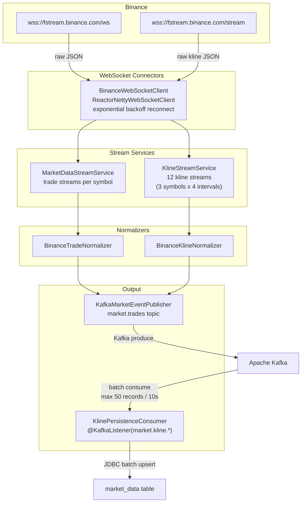

# market-data-service

> Reactive market data ingestion service — connects to Binance Futures WebSocket streams, normalises raw trade and kline events, publishes to Kafka, and batch-persists closed candles to PostgreSQL.

**Port:** `8081`  
**Spring Boot:** 4.0.5 | **Java:** 25 | **Model:** Spring WebFlux (fully non-blocking)

---

## Responsibilities

- Opens and maintains persistent WebSocket connections to Binance Futures streams for trades (`@trade`) and klines (`@kline_{interval}`)
- Subscribes to BTC, ETH, SOL across 4 timeframes: `1m`, `5m`, `15m`, `1h` — **12 concurrent streams**
- Normalises raw Binance JSON frames into typed `TradeEvent` and `KlineEvent` domain objects
- Publishes `TradeEvent` records to `market.trades` Kafka topic with idempotent producer config
- Publishes closed kline events to per-symbol `market.kline.*` Kafka topics
- Batch-consumes `market.kline.*` topics and upserts records into the `market_data` PostgreSQL table with a 4-column unique constraint for idempotency

---

## Internal Architecture



---

## API Reference

This service exposes **no HTTP endpoints** — it is a pure data pipeline service. All interactions happen via Kafka topics.

---

## Kafka Topics

### Produced

| Topic | Key | Value Type | Description |
|---|---|---|---|
| `market.trades` | `{symbol}` e.g. `btcusdt` | `TradeEvent` JSON | Every individual trade event from Binance |
| `market.kline.{symbol}` | `{symbol}` | `KlineEvent` JSON | Closed kline candles (all intervals) |

### Consumed

| Topic Pattern | Consumer Group | Batch Size | Description |
|---|---|---|---|
| `market.kline.*` | `kline-persister` | Up to 50 / 10s | Batch upsert of closed candles to PostgreSQL |

**Batch consumer config:**
- `max-poll-records: 50` — up to 50 records per poll
- `fetch.max.wait.ms: 10000` — flush after 10 seconds even if batch is not full
- On failure: retries once inline, then discards the batch and logs full context

### TradeEvent schema

```json
{
  "symbol":        "btcusdt",
  "tradeId":       123456789,
  "price":         63499.90,
  "quantity":      0.012,
  "timestamp":     1714521601234,
  "isBuyerMaker":  false
}
```

### KlineEvent schema

```json
{
  "exchange":   "BINANCE",
  "symbol":     "btcusdt",
  "interval":   "1m",
  "openTime":   1714521600000,
  "closeTime":  1714521659999,
  "open":       63450.10,
  "high":       63512.00,
  "low":        63430.50,
  "close":      63499.90,
  "volume":     12.345,
  "tradeCount": 482,
  "isClosed":   true
}
```

---

## Configuration

| Property | Env Var | Default | Description |
|---|---|---|---|
| `server.port` | — | `8081` | HTTP server port |
| `marketdata.exchange` | — | `binance` | Exchange identifier written to DB |
| `marketdata.symbols[0..1]` | — | `btcusdt, ethusdt` | Trade stream symbols |
| `marketdata.websocket.base-url` | — | `wss://fstream.binance.com/ws` | Binance trade WS base URL |
| `marketdata.websocket.reconnect-delay` | — | `5s` | Initial reconnect backoff |
| `marketdata.websocket.max-reconnect-delay` | — | `30s` | Maximum reconnect backoff |
| `marketdata.kafka.bootstrap-servers` | — | `localhost:9092` | Kafka broker address |
| `marketdata.kafka.trade-topic` | — | `market.trades` | Target topic for trade events |
| `marketdata.stream.auto-start` | — | `true` | Start streams on application startup |
| `marketdata.kline.symbols[0..2]` | — | `btcusdt, ethusdt, solusdt` | Kline stream symbols |
| `marketdata.kline.intervals[0..3]` | — | `1m, 5m, 15m, 1h` | Kline intervals to subscribe |
| `marketdata.kline.stream-base-url` | — | `wss://fstream.binance.com/stream` | Binance combined stream URL |
| `spring.datasource.url` | `POSTGRES_URL` | `jdbc:postgresql://localhost:5432/trading` | PostgreSQL JDBC URL |
| `spring.datasource.username` | `POSTGRES_USER` | `trading` | PostgreSQL username |
| `spring.datasource.password` | `POSTGRES_PASSWORD` | `trading` | PostgreSQL password |
| `spring.kafka.producer.acks` | — | `all` | Kafka producer acknowledgement level |

---

## Running Locally

```bash
# Infrastructure must be running
cd local-application-setup && docker compose up -d && cd ..

cd market-data-service
./mvnw spring-boot:run
```

After startup, verify streams are active via Kafka UI at `http://localhost:8087` → Topics → `market.trades`.

```bash
# Or with kcat (formerly kafkacat)
kcat -b localhost:9092 -t market.trades -C -o end
```

---

## Testing

```bash
cd market-data-service
./mvnw test
```

Key test class:
- `BinanceTradeNormalizerTest` — verifies JSON parsing of raw Binance trade frames into `TradeEvent` records

---

## Key Design Patterns

### Reactive WebSocket with infinite retry
`BinanceWebSocketClient` wraps Spring's `ReactorNettyWebSocketClient` in a `Flux.defer(...).repeat()` chain with `retryWhen(Retry.backoff(...))`:
- Drops → Flux re-subscribes automatically
- Delay starts at 5s, caps at 30s (exponential backoff)
- Retry count is `Long.MAX_VALUE` — effectively infinite

This is essential for a production data feed where WebSocket drops are expected during exchange maintenance or network interruptions.

### Idempotent Kafka producer
Producer is configured with `acks=all` and `enable.idempotence=true`, ensuring exactly-once delivery to the broker even under network retries. Combined with the `ON CONFLICT DO NOTHING` upsert in PostgreSQL, the end-to-end pipeline is fully idempotent — safe to replay or restart at any point.

### Batch consumer for throughput
`KlinePersistenceConsumer` uses `jdbcTemplate.batchUpdate()` rather than individual inserts, reducing PostgreSQL round-trips by up to 50×. Under heavy load (all 12 streams firing simultaneously), the consumer stays ahead of the producer without accumulating lag.

---

## Known Limitations / Future Improvements

- **No HTTP health endpoint** — adding `/actuator/health` would allow Kubernetes readiness probes
- **Single Kafka partition per topic** — increasing partition count enables parallel consumers and higher throughput
- **No dead-letter queue** — failed batches are discarded after one retry; a DLQ topic would allow replaying them
- **In-memory stream state** — there is no offset tracking beyond Kafka's consumer group mechanism; adding explicit offset management would enable exactly-once processing guarantees
