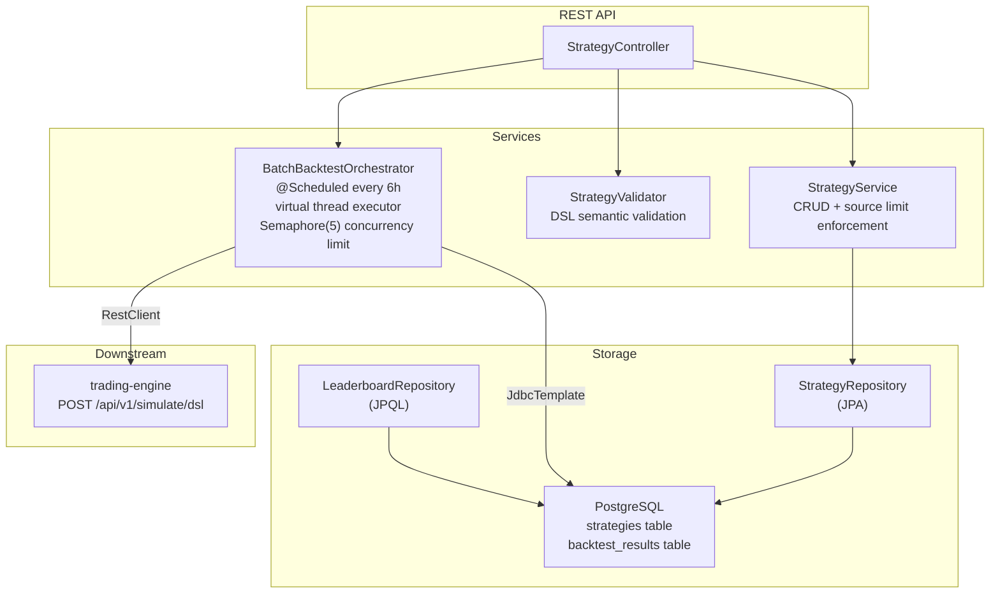

# strategy-service

> Strategy registry and batch backtest orchestrator — manages the full lifecycle of trading strategy definitions, enforces per-source capacity limits, and automatically validates all active strategies through the trading engine on a scheduled basis.

**Port:** `8083`  
**Spring Boot:** 4.0.5 | **Java:** 25 | **Model:** Spring MVC with virtual threads

---

## Responsibilities

- Provides CRUD operations for trading strategy definitions stored as JSONB in PostgreSQL
- Validates incoming strategy DSLs (indicator type checks, entry/exit rule syntax, risk parameter bounds)
- Enforces per-source capacity limits: BUILTIN (5), USER (20), LLM (50, evicts oldest), EVOLVED (20, evicts oldest)
- Exposes a strategy leaderboard ranked by Sharpe ratio from the latest backtest result per strategy
- Runs a batch backtest job every 6 hours: simulates all active strategies across BTC, ETH, SOL (90-day window) and persists results
- Provides a job-status API so callers can poll an async batch job's progress
- Exposes manual batch backtest trigger via REST for testing and CI

---

## Internal Architecture



---

## API Reference

| Method | Path | Description | Request Body | Response |
|---|---|---|---|---|
| `POST` | `/api/strategies` | Register a new strategy | `StrategyDSL` JSON | `RegisterStrategyResponse` or `ValidationResult` |
| `GET` | `/api/strategies` | List all active strategies | — | `List<StrategyRecord>` |
| `GET` | `/api/strategies/{id}` | Get strategy by UUID | — | `StrategyRecord` |
| `GET` | `/api/strategies/leaderboard?limit=50` | Leaderboard (best Sharpe, one row per strategy) | — | `List<BacktestSummary>` |
| `DELETE` | `/api/strategies/{id}` | Soft-deactivate a strategy | — | `{ "status": "DEACTIVATED", "id": "..." }` |
| `POST` | `/api/strategies/batch-backtest` | Trigger a batch backtest job | — | `BatchJob` (202 Accepted) |
| `GET` | `/api/strategies/batch-backtest/{jobId}` | Poll batch job status | — | `BatchJob` |

### StrategyDSL schema

```json
{
  "name":    "RSI Oversold Bounce",
  "version": "1.0",
  "source":  "USER",
  "indicators": [
    { "id": "RSI_14", "type": "RSI",  "params": { "period": 14 } },
    { "id": "EMA_21", "type": "EMA",  "params": { "period": 21 } },
    { "id": "SMA_50", "type": "SMA",  "params": { "period": 50 } }
  ],
  "entry": "RSI_14 < 30 AND EMA_21 > SMA_50",
  "exit":  "RSI_14 > 70",
  "risk": {
    "stopLossPct":     1.5,
    "takeProfitPct":   3.0,
    "positionSizePct": 10.0,
    "trailingStop":    false
  }
}
```

**Valid `source` values:** `BUILTIN` | `USER` | `LLM` | `EVOLVED`

### BatchJob response

```json
{
  "jobId":       "3f8a1c2d-...",
  "status":      "IN_PROGRESS",
  "totalCount":  12,
  "processed":   7,
  "succeeded":   6,
  "failed":      1,
  "startedAt":   "2026-04-14T02:00:00Z",
  "completedAt": null
}
```

---

## Kafka Topics Consumed

| Topic | Consumer Group | Description |
|---|---|---|
| *(none currently)* | — | The service publishes simulation calls via REST, not Kafka |

---

## Configuration

| Property | Env Var | Default | Description |
|---|---|---|---|
| `server.port` | — | `8083` | HTTP server port |
| `spring.datasource.url` | `POSTGRES_URL` | `jdbc:postgresql://localhost:5432/trading` | PostgreSQL JDBC URL |
| `spring.datasource.username` | `POSTGRES_USER` | `trading` | PostgreSQL username |
| `spring.datasource.password` | `POSTGRES_PASSWORD` | `trading` | PostgreSQL password |
| `spring.kafka.bootstrap-servers` | `KAFKA_BOOTSTRAP_SERVERS` | `localhost:9092` | Kafka broker (future use) |
| `trading-engine.base-url` | `TRADING_ENGINE_URL` | `http://localhost:8082` | Trading engine base URL |
| `spring.threads.virtual.enabled` | — | `true` | Enable virtual threads for MVC |

### Source capacity limits (hardcoded in `StrategyService`)

| Source | Limit | On overflow |
|---|---|---|
| `BUILTIN` | 5 | Hard reject |
| `USER` | 20 | Hard reject |
| `LLM` | 50 | Evict oldest active, then insert |
| `EVOLVED` | 20 | Evict oldest active, then insert |

---

## Running Locally

```bash
# Infrastructure and trading-engine must be running first
cd local-application-setup && docker compose up -d && cd ..
# Start trading-engine (needed for batch backtest)
cd trading-engine && ./mvnw spring-boot:run &

cd strategy-service
./mvnw spring-boot:run
```

### Verify

```bash
# Register a strategy
curl -s -X POST http://localhost:8083/api/strategies \
  -H "Content-Type: application/json" \
  -d '{
    "name": "RSI Test",
    "version": "1.0",
    "source": "USER",
    "indicators": [{ "id": "RSI_14", "type": "RSI", "params": { "period": 14 } }],
    "entry": "RSI_14 < 30",
    "exit": "RSI_14 > 70",
    "risk": { "stopLossPct": 2.0, "takeProfitPct": 4.0, "positionSizePct": 10.0, "trailingStop": false }
  }' | jq '.id, .status'

# List all active strategies
curl -s http://localhost:8083/api/strategies | jq '.[].name'

# View leaderboard
curl -s "http://localhost:8083/api/strategies/leaderboard?limit=10" | jq '.[0]'

# Trigger a batch backtest
curl -s -X POST http://localhost:8083/api/strategies/batch-backtest | jq '.jobId, .status'
```

---

## Testing

```bash
cd strategy-service
./mvnw test
```

The test suite covers `StrategyValidator` business rules and `StrategyService` source limit enforcement.

---

## Key Design Patterns

### Source-based capacity with LRU eviction
The `enforceSourceLimit()` method in `StrategyService` implements a sliding-window strategy registry: LLM- and EVOLVED-sourced strategies are capped but auto-rotate — the oldest is deactivated (soft delete, `is_active = false`) before the new one is inserted. This keeps the registry fresh without manual cleanup.

### Semaphore-bounded virtual-thread concurrency
`BatchBacktestOrchestrator` submits one `CompletableFuture` per strategy to a virtual-thread executor but guards concurrent trading-engine calls with a `Semaphore(5)`. This prevents overloading the trading engine with 20+ simultaneous simulation requests while still leveraging virtual threads for I/O concurrency.

### Recent-backtest skip logic
Before running a simulation, the orchestrator checks whether a backtest result already exists within the past 6 hours (`RECENT_CHECK_SQL`). This prevents redundant computation when the scheduler fires during a period of high change velocity — each strategy is tested at most once per 6-hour window.

### Job registry pattern
Batch job state (`jobId → BatchJob`) is stored in a `ConcurrentHashMap` in-process. REST callers poll `GET /api/strategies/batch-backtest/{jobId}` for progress. This is sufficient for a single-instance service; a distributed implementation would use Redis or a database-backed job table.

---

## Known Limitations / Future Improvements

- **In-memory job registry** — restarting the service loses all in-progress job state; use a database-backed job table for durability
- **No webhook on completion** — batch job results are only available via polling; add a callback URL parameter to the trigger endpoint
- **Leaderboard is best-ever, not rolling** — the query returns the best Sharpe across all time; a 30-day rolling leaderboard would be more actionable
- **Strategy validation is rule-based only** — there is no semantic check that entry/exit expressions reference valid declared indicator IDs; adding this check to `StrategyValidator` would catch DSL errors before they reach the trading engine
