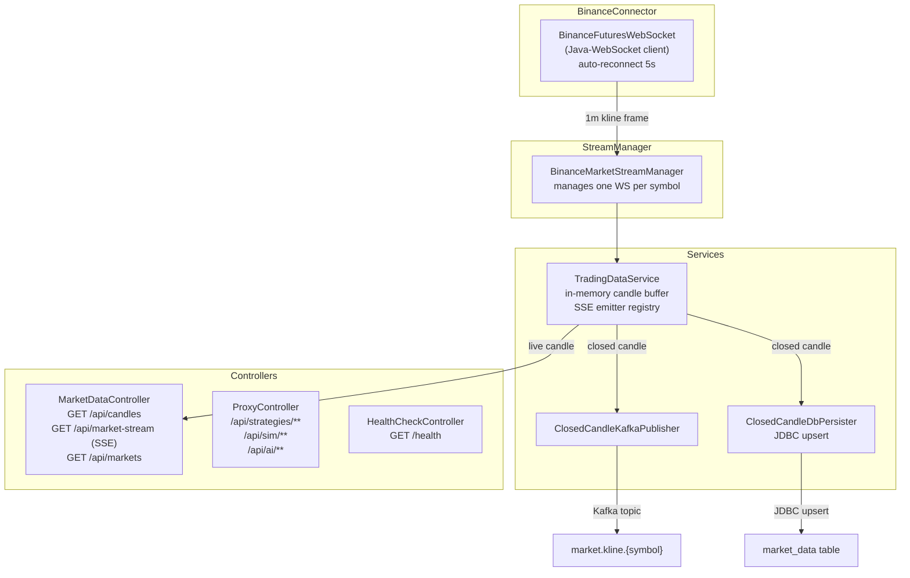

# trading-assistant-backend

> BFF (Backend For Frontend) gateway — bridges the React dashboard to live Binance Futures data and downstream microservices via a single, stable API surface.

**Port:** `8080`  
**Spring Boot:** 4.0.5 | **Java:** 25 | **Model:** Mixed MVC + WebFlux

---

## Responsibilities

- Maintains persistent Binance Futures WebSocket connections per trading symbol (BTC, ETH, BNB)
- Normalises raw Binance kline frames into `Candle` records and publishes them to SSE subscribers
- Publishes closed candles to `market.kline.*` Kafka topics for downstream persistence
- Upserts closed candles directly to the `market_data` PostgreSQL table via JDBC
- Serves the frontend's historical candle requests (`GET /api/candles`)
- Acts as a transparent reverse proxy to `strategy-service`, `trading-engine`, and `ai-service`, returning structured `503` responses when any downstream is unavailable

---

## Internal Architecture



---

## API Reference

### Market Data

| Method | Path | Description | Params | Response |
|---|---|---|---|---|
| `GET` | `/api/markets` | List all tracked symbols | — | `{ "symbols": ["btcusdt","ethusdt","bnbusdt"] }` |
| `GET` | `/api/candles` | Latest N closed candles | `symbol` (default: BTCUSDT), `limit` (10–500, default: 120) | `List<Candle>` |
| `GET` | `/api/market-stream` | SSE stream of live candles | `symbol` (default: BTCUSDT) | `text/event-stream` of `Candle` JSON |
| `GET` | `/health` | Health check | — | `{ "status": "UP" }` |

### Proxy Routes

All proxy routes forward to the matching downstream service and return the raw JSON response body.

| Path Pattern | Downstream Service | Notes |
|---|---|---|
| `/api/strategies/**` | `strategy-service :8083` | CRUD, batch backtest |
| `/api/sim/**` | `trading-engine :8082` | Simulation + optimisation |
| `/api/ai/**` | `ai-service :8084` | Strategy generation, memory, loop |

The proxy forwards all HTTP methods and non-hop-by-hop headers. Timeout: **30 seconds**.

### Candle JSON Schema

```json
{
  "symbol":    "BTCUSDT",
  "openTime":  1714521600000,
  "closeTime": 1714521659999,
  "open":      63450.10,
  "high":      63512.00,
  "low":       63430.50,
  "close":     63499.90,
  "volume":    12.345,
  "closed":    true,
  "interval":  "1m"
}
```

---

## Kafka Topics Produced

| Topic Pattern | Key | Message Format | Description |
|---|---|---|---|
| `market.kline.{symbol}` | `{symbol}` | `Candle` JSON | Published for every **closed** candle received from Binance |

Example topic names: `market.kline.btcusdt`, `market.kline.ethusdt`, `market.kline.bnbusdt`

> Consumed by: `market-data-service` (`kline-persister` consumer group) for batch upsert to `market_data`.

---

## Configuration

| Property | Env Var | Default | Description |
|---|---|---|---|
| `server.port` | — | `8080` | HTTP server port |
| `trading.symbols` | — | `btcusdt,ethusdt,bnbusdt` | Comma-separated list of symbols to stream |
| `app.frontend.origin` | — | `http://localhost:5173` | Allowed CORS origin |
| `spring.kafka.bootstrap-servers` | `KAFKA_BOOTSTRAP_SERVERS` | `localhost:9092` | Kafka broker address |
| `spring.datasource.url` | `POSTGRES_URL` | `jdbc:postgresql://localhost:5432/trading` | PostgreSQL JDBC URL |
| `spring.datasource.username` | `POSTGRES_USER` | `trading` | PostgreSQL username |
| `spring.datasource.password` | `POSTGRES_PASSWORD` | `trading` | PostgreSQL password |
| `proxy.strategy-service.url` | `STRATEGY_SERVICE_URL` | `http://localhost:8083` | Strategy service base URL |
| `proxy.sim-service.url` | `SIM_SERVICE_URL` | `http://localhost:8082` | Simulation service base URL |
| `proxy.ai-service.url` | `AI_SERVICE_URL` | `http://localhost:8084` | AI service base URL |

---

## Running Locally

```bash
# From repo root — start infrastructure first
cd local-application-setup && docker compose up -d && cd ..

# Start the service
cd trading-assistant-backend
./mvnw spring-boot:run

# Or with explicit env vars:
KAFKA_BOOTSTRAP_SERVERS=localhost:9092 \
POSTGRES_URL=jdbc:postgresql://localhost:5432/trading \
./mvnw spring-boot:run
```

**Start order matters:** `trading-engine` and `strategy-service` should be running before this service if you intend to use the proxy routes.

### Verify

```bash
# Health check
curl http://localhost:8080/health

# List tracked symbols
curl http://localhost:8080/api/markets

# Fetch last 10 BTC candles
curl "http://localhost:8080/api/candles?symbol=BTCUSDT&limit=10"

# Subscribe to live SSE stream (press Ctrl+C to stop)
curl -N http://localhost:8080/api/market-stream?symbol=BTCUSDT
```

---

## Testing

```bash
cd trading-assistant-backend
./mvnw test
```

The test suite covers the `BinanceFuturesWebSocket` connection lifecycle and `ProxyController` routing logic. Integration tests require Docker Compose infrastructure.

---

## Key Design Patterns

### Reconnect with fixed delay
`BinanceFuturesWebSocket` uses a single-thread `ScheduledExecutorService` to schedule reconnects exactly 5 seconds after a close event. A `shuttingDown` flag prevents reconnect attempts during graceful shutdown — avoiding a thundering herd when the JVM is stopping.

### Mixed MVC + WebFlux stack
`ProxyController` uses Spring `WebClient` (reactive) for non-blocking downstream proxying, while `MarketDataController` uses the Servlet-based `SseEmitter` for SSE. Running both in the same application is deliberate: SSE over the Servlet stack is simpler for this use case, while `WebClient` avoids blocking a thread per proxy call.

### Idempotent Kafka publishing
Closed candle events are identified by `(symbol, openTime, interval)`. The consuming `market-data-service` uses `ON CONFLICT DO NOTHING` on the `market_data` table, so duplicate Kafka deliveries are safe.

---

## Known Limitations / Future Improvements

- **No authentication** — all endpoints are publicly accessible. Adding JWT verification in a filter chain is the next step.
- **In-memory candle buffer** — `TradingDataService` holds recent candles in a `ConcurrentHashMap`. Under a restart, the buffer is empty until new candles arrive. A warm-up query against `market_data` on startup would fix this.
- **Single-instance SSE** — SSE emitters are stored in-process. Horizontal scaling would require a message bus (Redis Pub/Sub or Kafka) to broadcast to all instances.
- **Java-WebSocket library** — Consider migrating to Spring WebFlux's `ReactorNettyWebSocketClient` (used by `market-data-service`) for consistency and built-in backpressure support.
