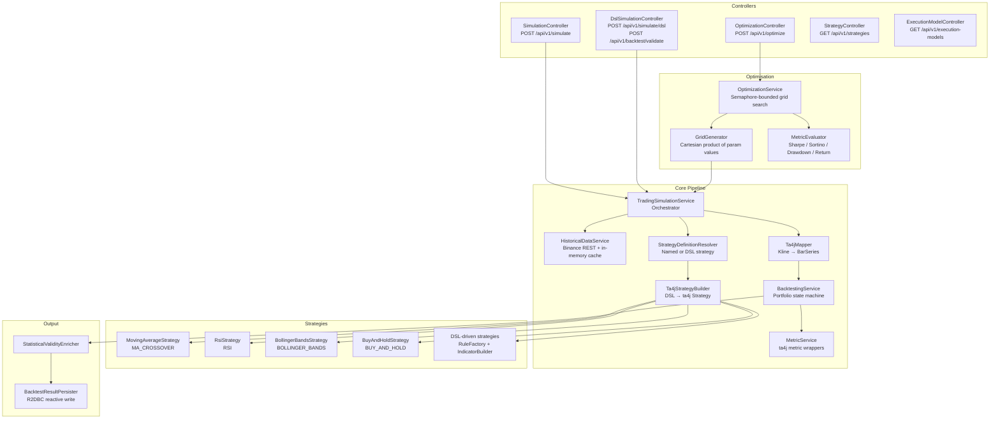

# trading-engine

> Reactive backtesting and optimisation engine — fetches historical Binance Futures klines, runs configurable trading strategies via ta4j, computes risk-adjusted metrics, and persists results to PostgreSQL via R2DBC.

**Port:** `8082`  
**Spring Boot:** 4.0.5 | **Java:** 25 | **Model:** Spring WebFlux (fully non-blocking)

---

## Responsibilities

- Fetches historical OHLCV klines from Binance Futures REST API (`/fapi/v1/klines`) for any symbol and interval
- Executes named strategies (MA_CROSSOVER, RSI, BOLLINGER_BANDS, BUY_AND_HOLD) and declarative DSL-defined strategies against historical data
- Simulates portfolio behaviour with realistic fee deduction (default 0.04%), configurable execution models (full balance, percent of balance, fixed amount), and Long/Short/Both trade directions
- Computes equity curves, trade logs, Sharpe ratio, max drawdown, win rate, and total return
- Enriches results with a statistical validity flag (minimum trade count, held-out validation window)
- Runs grid-search parameter optimisation over arbitrary parameter combinations using a virtual-thread pool
- Persists backtest results to PostgreSQL via R2DBC (non-blocking)

---

## Internal Architecture



---

## API Reference

### `POST /api/v1/simulate` — Run a named strategy backtest

**Request body:**
```json
{
  "symbol":   "BTCUSDT",
  "interval": "1d",
  "strategy": "RSI",
  "params": {
    "period":     14,
    "overbought": 70,
    "oversold":   30
  },
  "range": {
    "startTime": 1706745600000,
    "endTime":   1714521600000
  },
  "execution": {
    "type": "FULL_BALANCE",
    "tradeDirection": "LONG_ONLY",
    "params": {}
  },
  "assumptions": {
    "initialBalance": 10000.0,
    "feeRate": 0.0004
  }
}
```

**Response:**
```json
{
  "initialBalance":       10000.0,
  "finalBalance":         11805.42,
  "totalReturn":          18.05,
  "tradesCount":          42,
  "isStatisticallyValid": true,
  "validationNote":       null,
  "candles":              [...],
  "trades":               [...],
  "equityCurve":          [{"timestamp": 1706745600000, "equity": 10000.0, "closePrice": 43200.0}, ...]
}
```

### `POST /api/v1/simulate/dsl` — Run a DSL-defined strategy

Accepts a full `StrategyDSL` JSON object alongside the standard simulation parameters:

```json
{
  "symbol":   "BTCUSDT",
  "interval": "4h",
  "dsl": {
    "name":    "RSI Oversold Bounce",
    "version": "1.0",
    "source":  "USER",
    "indicators": [
      { "id": "RSI_14", "type": "RSI", "params": { "period": 14 } },
      { "id": "EMA_21", "type": "EMA", "params": { "period": 21 } }
    ],
    "entry": "RSI_14 < 30 AND EMA_21 > RSI_14",
    "exit":  "RSI_14 > 70",
    "risk": {
      "stopLossPct":     1.5,
      "takeProfitPct":   3.0,
      "positionSizePct": 10.0,
      "trailingStop":    false
    }
  },
  "range":      { "startTime": 1706745600000, "endTime": 1714521600000 },
  "execution":  { "type": "PERCENT_OF_BALANCE", "tradeDirection": "BOTH", "params": { "allocationPercent": 50 } },
  "assumptions": {}
}
```

### `POST /api/v1/backtest/validate` — Held-out validation

Same as `/api/v1/simulate/dsl` but restricts the simulation window to the **last 20%** of the requested date range (out-of-sample validation). Used by `strategy-service` for rigorous strategy evaluation.

### `POST /api/v1/optimize` — Grid-search parameter optimisation

```json
{
  "symbol":   "BTCUSDT",
  "interval": "1d",
  "strategy": "MA_CROSSOVER",
  "paramGrid": {
    "shortWindow": [5, 10, 15, 20],
    "longWindow":  [30, 50, 100, 200]
  },
  "metric": "SHARPE",
  "range": { "startTime": 1706745600000, "endTime": 1714521600000 }
}
```

**Optimisation metrics:** `TOTAL_RETURN`, `SHARPE`, `SORTINO`, `MAX_DRAWDOWN`, `WIN_RATE`

**Response:**
```json
{
  "bestParams":             { "shortWindow": 10, "longWindow": 50 },
  "bestScore":              1.84,
  "metricUsed":             "SHARPE",
  "evaluatedCombinations":  16,
  "successfulCombinations": 16,
  "topResults": [
    {
      "params":      { "shortWindow": 10, "longWindow": 50 },
      "totalReturn": 18.05,
      "maxDrawdown": 6.21,
      "tradesCount": 42,
      "winRate":     54.76,
      "sharpeRatio": 1.84,
      "score":       1.84
    }
  ]
}
```

### `GET /api/v1/strategies` — List available named strategies

Returns a list of strategy descriptors with name, description, and configurable parameters.

### `GET /api/v1/execution-models` — List execution model options

Returns available position-sizing models (`FULL_BALANCE`, `PERCENT_OF_BALANCE`, `FIXED_AMOUNT`).

---

## Available Strategies

| Name | Class | Key Parameters |
|---|---|---|
| `MA_CROSSOVER` | `MovingAverageStrategy` | `shortWindow` (default 10), `longWindow` (default 50) |
| `RSI` | `RsiStrategy` | `period` (default 14), `overbought` (default 70), `oversold` (default 30) |
| `BOLLINGER_BANDS` | `BollingerBandsStrategy` | `window` (default 20), `stdDevMultiplier` (default 2.0) |
| `BUY_AND_HOLD` | `BuyAndHoldStrategy` | None — baseline benchmark |
| `DSL` / `CUSTOM` | `DslStrategyAdapter` | Declarative via `indicators`, `entryRules`, `exitRules` in request body |

---

## Execution Models

| Type | Description |
|---|---|
| `FULL_BALANCE` | Allocates 100% of available cash to each trade |
| `PERCENT_OF_BALANCE` | Allocates a configurable percentage (`allocationPercent`) per trade |
| `FIXED_AMOUNT` | Allocates a fixed dollar amount per trade (capped at available cash) |

---

## Configuration

| Property | Env Var | Default | Description |
|---|---|---|---|
| `server.port` | — | `8082` | HTTP server port |
| `binance.base-url` | — | `https://fapi.binance.com` | Binance Futures REST base URL |
| `binance.klines-path` | — | `/fapi/v1/klines` | Kline endpoint path |
| `binance.connect-timeout` | — | `5s` | WebClient connect timeout |
| `binance.read-timeout` | — | `15s` | WebClient read timeout |
| `binance.default-limit` | — | `1000` | Default kline fetch limit |
| `trading.simulation.initial-balance` | — | `1000.0` | Default starting balance (USD) |
| `trading.simulation.fee-rate` | — | `0.0004` | Default maker/taker fee rate (0.04%) |
| `trading.optimization.thread-pool-size` | — | `6` | Virtual-thread pool for grid search |
| `trading.optimization.top-results-limit` | — | `5` | Number of top results returned |
| `trading.optimization.task-timeout` | — | `10s` | Timeout per optimisation task |
| `spring.codec.max-in-memory-size` | — | `2MB` | Max request buffer (for large param grids) |
| `spring.r2dbc.url` | `POSTGRES_HOST` | `r2dbc:postgresql://localhost:5432/trading` | R2DBC connection URL |
| `spring.r2dbc.username` | `POSTGRES_USER` | `trading` | Database username |
| `spring.r2dbc.password` | `POSTGRES_PASSWORD` | `trading` | Database password |

---

## Running Locally

```bash
# From repo root — start infrastructure first
cd local-application-setup && docker compose up -d && cd ..

cd trading-engine
./mvnw spring-boot:run
```

### Sample requests

```bash
# Quick RSI backtest (last ~90 days, daily bars)
curl -s -X POST http://localhost:8082/api/v1/simulate \
  -H "Content-Type: application/json" \
  -d '{
    "symbol": "BTCUSDT",
    "interval": "1d",
    "strategy": "RSI",
    "params": { "period": 14, "overbought": 70, "oversold": 30 },
    "range": { "startTime": 1706745600000, "endTime": 1714521600000 },
    "execution": { "type": "FULL_BALANCE", "tradeDirection": "LONG_ONLY", "params": {} },
    "assumptions": {}
  }' | jq '{totalReturn, tradesCount, finalBalance}'

# Optimise MA Crossover parameters
curl -s -X POST http://localhost:8082/api/v1/optimize \
  -H "Content-Type: application/json" \
  -d '{
    "symbol": "BTCUSDT",
    "interval": "1d",
    "strategy": "MA_CROSSOVER",
    "paramGrid": {
      "shortWindow": [5, 10, 15],
      "longWindow":  [30, 50, 100]
    },
    "metric": "SHARPE",
    "range": { "startTime": 1706745600000, "endTime": 1714521600000 }
  }' | jq '.bestParams, .bestScore'
```

---

## Testing

```bash
cd trading-engine
./mvnw test
```

Test coverage includes:
- `BacktestingServiceTest` — portfolio state machine, fee deduction, long/short/both directions
- `TradingSimulationServiceTest` — end-to-end simulation with mocked historical data
- `MovingAverageStrategyTest` — crossover signal generation edge cases
- `StrategyFactoryTest` — strategy creation from parameter maps
- `IndicatorFactoryTest` — indicator construction for all supported types
- `GridGeneratorTest` — Cartesian product generation for param grids
- `MetricEvaluatorTest` — Sharpe, Sortino, drawdown, win rate calculations
- `StrategyDefinitionResolverTest` — DSL-to-internal-definition resolution

---

## Key Design Patterns

### Reactive non-blocking pipeline
The entire simulation pipeline is a `Mono` chain: `fetchKlines → buildSeries → simulate → enrich → persist`. No thread is ever blocked — all I/O (Binance REST fetch, R2DBC persist) is non-blocking. This allows the service to handle concurrent optimisation jobs on a small thread pool without CPU contention.

### Portfolio state machine
`BacktestingService` maintains a `PortfolioState` record (cash balance, position quantity, position side, entry notional). State transitions are driven by ta4j's `Strategy.shouldEnter()` / `shouldExit()` decisions at each bar. This approach cleanly separates signal generation from portfolio accounting.

### Strategy pluggability via factory pattern
`StrategyFactory` and `StrategyRegistry` map strategy names to implementations. Adding a new strategy requires only implementing the `Strategy` interface and registering it in the factory — no changes to the controller or simulation pipeline.

### Statistical validity enrichment
Before returning results, `StatisticalValidityEnricher` flags results with fewer than a minimum number of trades as statistically invalid. This prevents consumers (AI service, frontend) from promoting strategies that appear profitable due to tiny sample sizes.

---

## Known Limitations / Future Improvements

- **No kline caching** — every simulation fetches from Binance REST. Adding an in-memory or Redis cache keyed on `(symbol, interval, startTime, endTime)` would dramatically reduce Binance API calls during optimisation
- **Single-leg positions only** — the engine does not simulate partial fills, slippage, or limit orders; all trades execute at the closing price of the bar
- **Optimisation is CPU-bound** — the virtual-thread pool works well for I/O-heavy workloads; for pure CPU-bound indicator computation, a `ForkJoinPool` would yield better throughput
- **No walk-forward testing** — implementing rolling out-of-sample windows would provide more robust strategy validation than a single held-out period
